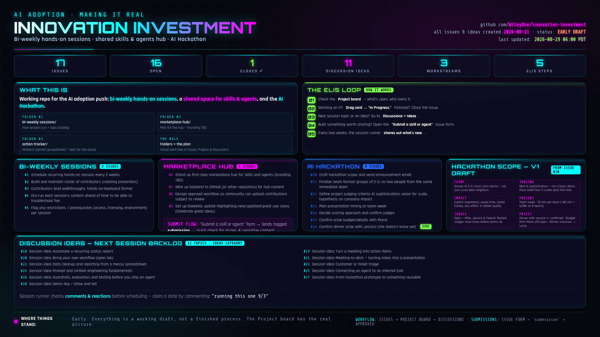

# Innovation Investment: Making It Real

Working repo for the AI adoption push from the "Making it Real" deck: bi-weekly hands-on sessions, a shared space for skills and agents, and the AI Hackathon. Three folders, roughly matching the three things we're building.

- `bi-weekly-sessions/`: how the sessions run, plus a backlog of topic ideas.
- `marketplace-hub/`: plan for a shared space for skills and agents. No name for it yet, branding's TBD.
- `action-tracker/`: where this started, as a spreadsheet. Kept for the record. Not where tracking happens now, see below.

## Setup

Cloning fresh:

```bash
git clone https://github.com/WileyOne/innovation-investment.git
cd innovation-investment

git config --global user.name "Your Name"
git config --global user.email "you@example.com"
```

Use whatever email is verified on your GitHub account, that's how commits link to your profile. Don't want your real address in the history? Grab the private one from [github.com/settings/emails](https://github.com/settings/emails).

Branch, commit, push, PR.

```bash
git checkout -b your-branch-name
# make your changes
git add -A
git commit -m "Describe the change"
git push -u origin your-branch-name
```

Open the PR at [github.com/WileyOne/innovation-investment/compare](https://github.com/WileyOne/innovation-investment/compare).

The Issues, Project board, and Discussions below came from running `scripts/setup-github-features.sh` once, with the [GitHub CLI](https://cli.github.com/) authenticated (`repo` and `project` scopes):

```bash
gh auth login
gh auth refresh -s project
```

Run it once. Re-running it duplicates the issues and discussions instead of updating them. Adding a couple things after the fact? Just do it by hand in the UI.

## ELI5

1. Got something to do, or want to know what's open? Check the [Project board](https://github.com/users/WileyOne/projects/1).
2. Working on something? Drag its card to "In Progress." Finished? Close the issue.
3. Want to know what the next session should cover, or have an idea? Go to [Discussions > Ideas](https://github.com/WileyOne/innovation-investment/discussions).
4. Built something worth sharing? Open a [New Issue and pick "Submit a skill or agent."](https://github.com/WileyOne/innovation-investment/issues/new/choose)
5. Every two weeks, whoever's running the sessions looks at what's new and shares it out.

That's it. Everything below is the same thing with more detail.

## How this gets used

The folders above are the plan. The actual work happens in Issues, Projects, and Discussions.

### Tracking what's happening

The [Project board](https://github.com/users/WileyOne/projects/1) is the fastest read: owner, due date, category, status, all on the card. Pick something up, drag it to "In Progress." Close the issue when it's done. Debating something or hit a blocker? Put it in the comments on the issue, not Slack, so it's still findable in three months. Full list's also in [Issues](https://github.com/WileyOne/innovation-investment/issues) if you'd rather scroll than look at cards.

### Picking the next session topic

Topic backlog is in [Discussions](https://github.com/WileyOne/innovation-investment/discussions), under "Ideas." I'll check what's got comments or reactions before scheduling and run whichever's getting pull. Want something specific? Say so there. Backlog running dry? Add your own. Claim a date by commenting it: "running this one 9/3."

### Submitting something to the hub

Built something worth sharing? Use the [**Submit a skill or agent**](https://github.com/WileyOne/innovation-investment/issues/new/choose) issue form. A few fields: what it does, how to reuse it, who to bug with questions. Fields are documented in [`SUBMISSION_TEMPLATE.md`](marketplace-hub/SUBMISSION_TEMPLATE.md) if you want to see them first. These land tagged `submission`, all of them [here](https://github.com/WileyOne/innovation-investment/issues?q=is%3Aissue+label%3Asubmission). Review is a quick check for dupes and anything sensitive, then I close it out as approved.

### The part I still do by hand

Every couple weeks I go through what's newly closed under `submission` and what's new in Discussions and share it out. Not automated yet. It's a decent excuse to actually read what people built instead of just tracking that it exists.

## Where things stand

Early. Everything here is a working draft, not a finished process. Project board has the real picture of what's open and who owns it.